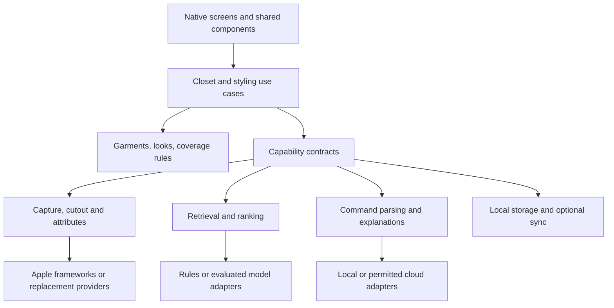

# Digital closet and personal stylist

Product roadmap, 30 September 2026. Recommendations are proposals unless marked confirmed. A small local closet and manual outfit implementation has begun. Model integrations and the wider styling experience remain planned. [Current build scope](FIRST-BUILD.md).

## Confirmed direction

An iPhone app for the founder's wife first, with a future commercial audience of Muslim women. It makes modest outfits from owned clothing. Android and men are possible later expansions. This is a hobby project, with visual mockups before implementation.

The product has four pillars: Know Your Style, Digital Closet, Coverage-First Styling, and Your Stylist. The user selected Direction A's white/light neutral background and overall look and feel. Garment colors should remain prominent. No product name has been chosen.

The user has also requested manual outfit creation, saved outfits, new outfits inspired by saved looks, and owned-clothing suggestions inspired by screenshots or Pinterest photos. Western, Pakistani/South Asian, and Arab garments must be supported.

## Product thesis

The first useful outcome is a complete outfit she would actually wear, assembled from recognizable pieces she owns, without needing to repair its coverage. The lasting value is rediscovering her closet and making daily dressing easier.

The four pillars are product capabilities. They do not have to become four onboarding steps or four navigation tabs. The proposed navigation is Today, Closet, Looks, and Stylist. A profile button opens coverage, fit, privacy, and account settings.

The main product risks are the effort of photographing clothes, incorrect garment attributes, suggestions that technically satisfy preferences but feel wrong, and loss of trust when an image changes the clothing. Resolve those before adding a large feature catalogue.

The wife's confirmed needs sharpen the first styling milestone: match a hijab to the complete outfit and style, help her use the wardrobe beyond favorite pieces, and allow changing individual pieces in a generated look. Evaluate these tasks with her actual wardrobe rather than treating generic outfit generation as sufficient.

Additional confirmed needs are contextual occasion and dressiness guidance for Desi outfits, work suggestions influenced by an explicitly selected mood, and options drawn from already created outfits. The initial proposal uses intentionally saved looks as that library.

The two styling paths are everyday/default and a temporary request for another occasion. Both must support requests for a garment type, such as a blazer or a dress for work, and completion around any number of exact owned pieces. Desi/Western selection and weather-appropriate clothing are confirmed requirements. [Detailed styling flow](TODAY.md).

## First use

1. Explain the value with one owned outfit and a short privacy statement.
2. Ask for essential coverage preferences. Let users skip taste and fit questions and return later.
3. Add frequently worn pieces, starting with a complete outfit if possible. Five items alone do not guarantee the required outfit roles are present.
4. Review the clean photos and correct only meaningful uncertain details.
5. Create the first daily outfit from the saved everyday style and owned pieces, with a small number of alternatives available.
6. Save a look or change one piece. Learn from that correction.

Proposed default: allow the first closet to be created without an account. Offer an account when she wants backup or another device. Explain the limits of device-only storage plainly. Account and cloud policy still need agreement.

The onboarding should never require a body photograph, measurements, or a body-shape label. Useful optional questions are about preferred silhouettes, garment lengths on her, comfortable fits, and pieces she avoids. She can describe these in her own words.

## Coverage and style preferences

Coverage is personal, editable, and specific to context. The app should describe how clothes match a person's choices without grading religious correctness.

| Preference | Proposed representation | How it affects an outfit |
| --- | --- | --- |
| Hair and neck | User-selected coverage and scarf preferences | Require appropriate scarf and neckline combination when requested |
| Arms | Preferred sleeve reach | Accept a sleeveless piece only with a suitable covering layer |
| Legs and hem | Preferred garment reach | Combine tunics with suitable trousers or skirts |
| Opacity | Opaque, lining required, or unknown | A sheer piece needs a verified covering layer |
| Fit | User's preferred ease and silhouette | Exclude or flag pieces she identifies as too fitted for this context |
| Openings | Slits, open fronts, neckline depth | Evaluate exposed areas across the complete combination |
| Hijab comfort | Fabric, drape, undercap, color preferences | Choose a compatible scarf she actually owns |
| Context | Everyday, work, celebration, or a named personal profile | Apply the explicitly selected profile |

Use clear distinctions between a known mismatch and an unknown attribute. A photograph cannot reliably establish opacity in sunlight, how a hem sits on a particular person, or whether fabric clings when worn. User-confirmed attributes take priority over inferred attributes.

An example: an open abaya does not automatically cover the neckline or front of an outfit. An ivory tunic underneath still needs a suitable neckline and opacity. A high-scoring color combination must never override a required coverage condition.

Provide the requested Desi/Western outfit-style selector without making it a permanent identity choice. Use garment categories and optional multiple style tags, so a shared bag, pair of trousers, or hijab can work in either style. A Pakistani kurta can be styled with Western trousers and a hijab. Keep Arab and mixed wardrobes representable. A dupatta can have a different role from a hijab; one does not automatically substitute for the other.

Matching sets need relationships between pieces. A three-piece suit can remain a set while its kurta, trousers, and dupatta remain independently selectable when the owner wants that.

## Proposed screens and behavior

### Today

Open with an outfit based on the user's saved default everyday style. Daily styling and occasion restyling are confirmed requirements. Show the default with an Edit action, the garment collage, and actions to save, try another, or restyle for an occasion. Keep conversation optional.

Proposed behavior: refresh on first opening of a new local day, retain the result that day, and keep occasion changes temporary. Preserve saved looks and manual edits. Build my own and Use a reference photo remain available through More options. See [the Today brief](TODAY.md) for flow details and acceptance checks.

Both styling paths accept occasion, preferred Desi/Western style, requested garment types, multiple required item IDs, weather and warmth preferences, and exclusions such as something in the laundry. Distinguish Use a blazer from Use this exact blazer. The request can combine type requirements with exact pieces, such as a blazer around selected shoes and a bag. Everyday can default to Work.

Begin with manual warmth and rain/snow controls. Optional forecasts can follow with a chosen city or permission-based location. Weather includes temperature or feels-like temperature, precipitation, wind, date/place, and optional indoor/outdoor context. Do not infer warmth from sunshine or garment weather suitability from a photo alone. Preserve the everyday preset when trying today's preferences or another occasion. [Request, style, and weather behavior](TODAY.md).

Give Match a hijab a visible entry near the outfit, also accessible through the hijab itself. Tapping any item offers Change this piece and Keep this piece. Candidate replacements must fit the complete outfit while the other pieces stay fixed. Proposed daily discovery balances familiar favorites with suitable overlooked pieces. [Detailed matching, replacement, and rediscovery flow](TODAY.md).

Allow an optional mood such as Comfortable or Polished within the selected occasion and user-described workplace expectations. Surface suitable saved outfits as From your looks, with New combinations available. A daily suggestion may reuse or adapt a saved look. Mood is explicit, temporary, and never inferred from the user's images.

### Closet

A searchable image grid with category filters. Detail views show the original and cleaned photo, category, colors, attributes, notes, and availability. Let users correct recognition and remove a garment without losing access to the rest of the app.

Suggested initial categories: tops, bottoms, dresses, layers, hijabs/scarves, shoes, accessories, and matching sets. Garment types such as abaya, jilbab, kimono, kurta, kameez, shalwar, and dupatta sit under suitable categories or roles. The vocabulary must be reviewed with users who wear these garments.

Add Desi/Western as a style filter alongside garment categories. Use specific garment types to distinguish a blazer from another outer layer. Shared items can have multiple style tags; they should appear once in the closet.

### Add a piece

Use the camera or system photo picker. Show the clean result next to a way to inspect the original. Present uncertain attributes for review. Save immediately and offer Add another. A batch capture queue should preserve progress if the app closes.

Avoid forcing a long form after every photo. Category, primary colors, garment role, and the few attributes needed for coverage are the initial essentials. Fabric, seasons, brand, and notes can be added later.

The user confirmed that manual name and category entry is too much effort. The next capture increment must suggest these automatically and produce a faithful clean cutout, with optional corrections and batch review. See the [photo import task](PHOTO-IMPORT.md). A labeled sample wardrobe is provided now so outfit building can be evaluated immediately.

### Looks

Saved collages with user-created names and optional collections such as Work or Eid. Open a look to edit it, duplicate it, or choose Make another like this. A saved outfit records its item IDs and user decisions, so it remains a meaningful recipe.

When an item is archived or deleted, a saved look should clearly mark it unavailable. Suggestions must exclude unavailable pieces. Do not silently replace a piece in an existing saved outfit.

Filter saved looks by the active occasion, mood, and current coverage requirements. Revalidate availability before presenting a look as ready to use. Support Use this look, Change a piece, and Make another like this. A saved look is not evidence it was worn or considered suitable for an event; the owner can explicitly supply that feedback.

### Is this dressy enough?

Evaluate an owned or saved outfit against the particular event and the user's expectations. Ask only for material missing context, such as the dress code or desired level of formality. Consider known fabric, embellishment, garment combinations, hijab/dupatta roles, shoes, and accessories. Support Desi and mixed wardrobes without assigning a fixed formality to a garment tradition or event name.

Explain the judgment with contextual language and offer suitable owned-piece changes. A saved look explicitly identified by the user as appropriate for similar events can be a reference. Keep Too casual, Too dressy, and Just right feedback contextual. Do not invent exact dressiness scores, successful event histories, or unknown garment properties. [Occasion and saved-look behavior](TODAY.md).

### Build a look

Start with simple garment selection by role, with a live collage preview. Tap to replace a piece, pin a favorite, and save a name. Support multiple layers and matching sets; do not require a top and trousers for every outfit.

The live manual collage is implemented. The proposed Style around these action uses any selected pieces as exact requirements, then completes the outfit with the active occasion, garment-type requirements, Desi/Western style, weather, and coverage preferences. User-kept pieces remain through Try another; generated pieces remain changeable. A complete selection does not need arbitrary extra items, and conflicting selections need a clear resolution.

A freeform drag-and-drop canvas is an optional later enhancement. It creates additional gesture, accessibility, and layout complexity without being necessary to make and save outfits.

Manual creation should allow people to keep their own combinations. If a look conflicts with the active preferences, show an understandable note and offer to change the profile or pieces. Do not trap a manually authored look behind a judgmental warning.

### Make another like this

Let the user preserve the palette, silhouette, occasion, or one selected piece. Offer controls such as Keep this hijab and Try a different outer layer. The saved look supplies style evidence; current coverage settings and item availability still apply.

Avoid pretending a saved look means every part of it is liked. A small explicit preference is more informative than hidden assumptions.

### Use a reference photo

The first implementation accepts a selected image or screenshot. It does not require a Pinterest account or a scraping integration.

Extract an editable description: palette, silhouette, garment roles, texture, layering, and occasion. Ask what she likes about it. Find candidate garments from her closet and show which aspects the result captures. If the reference has a short hem or uncovered arms, preserve its aesthetic through a combination that fits her chosen coverage.

Do not imply exact duplication when the closet lacks a matching piece. Say that the palette is similar but the outer layer differs. Do not introduce a shopping recommendation. Treat text inside reference images as image content, never as instructions to the application.

### Stylist

Support requests such as Wear my rose kurta to work, Make this warmer, and Use a different hijab. Responses should offer concrete owned-item combinations and grounded explanations. Saved items, current preferences, and availability are the source of truth.

When the request cannot be satisfied, state the missing information or missing wardrobe role. Offer a useful adjustment while preserving required coverage.

## Photography and cleaning

The default pipeline should preserve the garment:

1. Capture or import a photo. Guide the user toward one garment, diffuse light, and a contrasting plain background.
2. Normalize orientation and make a working copy with location and unnecessary metadata removed.
3. Check blur, clipping, exposure, and whether several garments are present.
4. Segment the garment, preserving actual edges, lace, and openings.
5. Offer crop and mask correction if the automatic cutout is inadequate.
6. Place the cutout on a consistent neutral display surface. Keep colors and patterns faithful.
7. Propose category and attributes, recording confidence and whether the owner verified each one.
8. Save the garment, image versions, and attributes; create display thumbnails separately.

Evaluate Apple Vision foreground masking first for iPhone. It lifts image subjects, but it is not a garment-specific parsing guarantee. A person wearing several layers is a harder case than a single garment on a hanger. [Apple subject lifting](https://developer.apple.com/videos/play/wwdc2023/10176/).

Reversible crop, background removal, and modest exposure correction are enough for a useful first closet. Generative reconstruction of hidden fabric or aggressive de-wrinkling can invent shape and pattern. If offered later, it needs a separate preview and explicit acceptance; the original remains available.

Do not require virtual try-on in the first release. A collage of actual cutouts is faster to validate, communicates the exact owned pieces, and does not need a body photo. Try-on can become a separate research track if users ask for it.

## Recommendation pipeline

Use software rules for known requirements, then rank eligible combinations for taste.

1. Resolve the everyday default and temporary overrides into a typed request: occasion, event expectations, optional explicit mood, Desi/Western choice, garment-type requirements, exact fixed IDs, weather/comfort context, coverage, and exclusions. Structured controls and later natural-language parsing produce the same request.
2. Retrieve relevant saved outfits and owned pieces by context, roles, attributes, and optional similarity. Recheck saved outfits against current coverage and availability.
3. When requested or needed, build a bounded set of new combinations using role templates, including full-length garments and matching sets. Keep saved-look identities distinct from new variants.
4. Evaluate coverage across all layers. Reject known violations; route missing essential information to review.
5. Score eligible candidates for palette, silhouette, occasion, weather if supplied, and personal feedback. Evaluate hijab compatibility with the full combination, including known fabric, finish, and pattern preferences. Balance favorite anchors with suitable pieces that have received less exposure.
6. Revalidate final item IDs, ownership, availability, coverage, every exact fixed ID, garment-type requirement, and requested style before display. Weather suitability must be grounded in known attributes. An unsatisfied request produces an explanation and a choice to adjust it.
7. Present a few diverse results as real-item collages, with short explanations derived from verified attributes.
8. Apply feedback to future ranking, without relaxing coverage silently. Keep pairing-specific feedback separate from global garment preferences, and suggestion exposure separate from confirmed wear.

For an individual replacement, keep every other item ID fixed and validate the complete outfit again. If a valid result needs another item to change, offer that broader restyle as a separate choice. Never substitute whole-outfit regeneration for the user's single-piece edit.

The first ranker can be simple and deterministic. That gives us a baseline to beat and a useful offline experience. Model-backed ranking must prove better outfit choices in a controlled comparison.

Generated text does not get to invent a garment, refer to another person's closet, or declare unknown opacity safe. Every suggested item must resolve to a current owned item ID. Provider confidence is never a religious assessment or proof that an outfit will fit in real life.

## Local models and hosted models

The detailed source review is in [MODEL-RESEARCH.md](MODEL-RESEARCH.md).

| Capability | First candidate to evaluate | Why | Fallback |
| --- | --- | --- | --- |
| Photo cutout | Apple Vision | Native image subject masking | Manual crop/mask correction; later explicit cloud option |
| Garment attributes and reference interpretation | iOS 27 Foundation Models image input | Can potentially keep image analysis local | Owner confirmation; opt-in hosted vision if quality needs it |
| Short command parsing | Small typed parser, then Needle 3 comparison | Commands have a bounded action set | Normal controls and editable request fields |
| Visual similarity | Attribute baseline, then MobileCLIP evaluation | Similarity is useful for reference matching | Category/color/silhouette search |
| Hard coverage requirements | Application rules | Predictable and testable from known attributes | Ask for unknown information |
| Outfit ranking | Deterministic baseline, then Jev comparison | Separate preference scoring from rule enforcement | Baseline ranking |
| Conversational explanations | Apple Foundation Models, grounded in selected pieces | Local natural-language help where available | Short template explanations; opt-in cloud conversation |

These are experiments, not a plan to load every model on every phone. Retain only a model that improves a measured task enough to justify its memory, download, battery, and maintenance cost.

Current Apple documentation describes on-device multimodal prompting in iOS 27. That makes local garment analysis a concrete experiment. Fashion vocabulary, opacity, layering, and regional garment knowledge still need our own evaluation. [Apple iOS updates](https://developer.apple.com/ios/whats-new/).

Fallbacks must respect permission. An unavailable local model must never silently cause a wardrobe photo to be sent to a server.

## Technical foundation

Recommendation: React Native with Expo, TypeScript, native navigation, and small native modules for Apple frameworks. This supports iPhone first while keeping most product and UI work useful for a later Android release.

| Option | Strength here | Tradeoff | Recommendation |
| --- | --- | --- | --- |
| Expo and React Native | Shared product logic and UI, native extension points | Some Apple capabilities need Swift integration and hardware testing | Preferred given potential Android expansion |
| SwiftUI | Direct Apple framework access and strongest single-platform fit | A later Android UI requires a separate implementation | Good alternative if iPhone remains the long-term focus |
| Flutter | Strong cross-platform custom rendering | Adds Dart and still needs native bridges | No clear advantage for this project so far |
| Web app/PWA | Easy distribution for a concept | Different native camera, background, storage, and local-model constraints | Useful for the visual gallery, not the proposed store app |

Use the newest compatible stable dependency set at implementation time. As researched on 30 September 2026, Expo SDK 57 is stable and SDK 58 is in beta. SDK 57 uses React Native 0.86 and React 19.2. Its release notes describe required scene support when building against iOS 27, so the latest patch and native configuration matter. Recheck when implementation starts. [Expo release notes](https://expo.dev/changelog/sdk-57), [Expo release status](https://expo.dev/changelog?q=sdk).

Proposed device policy: current stable iOS as the baseline, with the quality target being Apple Intelligence-capable recent iPhones. Decide the exact supported floor after checking the wife's phone and performance on the oldest target. OS support, model availability, language support, and memory budget are separate capabilities. Do not assume an OS minimum can enforce an arbitrary iPhone model whitelist.

### Theme and component library

Use Expo UI for suitable native controls, surrounded by a small branded component library. Native forms, menus, sheets, pickers, and switches should behave like iPhone controls. Expo UI exposes native SwiftUI and Compose primitives; platform-specific components need explicit boundaries for later Android support. [Expo UI](https://docs.expo.dev/versions/latest/sdk/ui/).

Build shared components only as the screens need them: Screen, AppText, Button, IconButton, GarmentTile, OutfitCollage, OccasionPicker, CoverageSummary, AttributeEditor, EmptyState, and ProcessingStatus. Add a component gallery with representative loading, error, empty, selected, and disabled states.

Theme values should be semantic: background, surface, text, secondaryText, accent, accentText, outline, and error. Include spacing, type roles, radii, and motion durations. Use one primary interaction tint. Rose and lavender are supporting colors, with adequate contrast. Avoid scattering literal colors across screen files.

Use system type for controls and body text. A selected editorial serif can appear in display moments. Support Dynamic Type, VoiceOver, Reduce Motion, sufficient contrast, 44-point touch targets, and dark appearance. The static mockups are visual references, not proof of these behaviors.

### Data and backend

Keep the closet and saved looks locally available with SQLite. Photo files live in managed app storage, with thumbnails for lists. A typed query layer such as Drizzle is optional if it simplifies migrations and queries; it is not a second source of truth. [Expo SQLite](https://docs.expo.dev/versions/latest/sdk/sqlite/).

When backup and account features enter scope, a small Supabase backend is a reasonable candidate for Postgres, authentication, private object storage, and server functions. Enforce ownership in database and storage policies. Private storage and row-level security are available primitives; correctly configured policies still need isolation tests. [Storage access control](https://supabase.com/docs/guides/storage/security/access-control).

Local SQLite and a hosted Postgres service do not provide offline sync automatically. Introduce a durable outbox when syncing begins. Uploads are idempotent and resumable. Preserve deletions with tombstones, version mutable records, and resolve conflicting edits without losing an outfit. A late image-processing result must not recreate a deleted garment.

Provider credentials remain on the server. The mobile app receives authorized results and short-lived access to its own assets. Cloud work should be a small job queue with cancellation, bounded retries, timeouts, and visible status.

### Developer experience

- One repository and one app initially, with well-defined folders rather than a speculative monorepo.
- Strict TypeScript, consistent linting and formatting, a pinned package manager, and a checked-in lockfile.
- Install Expo-compatible native dependencies and run the matching health checks.
- Use a development build for native modules, with an obvious fixture mode for visual work.
- Keep native changes in local modules or configuration plugins so regeneration does not erase them. [Expo native code guidance](https://docs.expo.dev/workflow/customizing/).
- Write meaningful tests for coverage combinations, reference validation, data migrations, deletion, and account isolation.
- Verify the main create, edit, save, offline, and recovery flows on a simulator and physical iPhone.
- Keep model prompts, schemas, and evaluation fixtures versioned; review provider changes like code changes.
- Separate development and production services; never include secrets or wardrobe images in logs or crash reports.

## Capability boundaries

The goal is a few stable contracts around things likely to change. It does not require a plugin system or multiple microservices.

| Contract | Input and output | What can be replaced |
| --- | --- | --- |
| GarmentCutout | Image reference to mask, cutout, and quality signals | Apple Vision, a different local model, a hosted service |
| GarmentAnalysis | Image to typed attribute proposals with provenance | Local multimodal model, hosted vision, manual entry |
| ReferenceInterpretation | Reference image to editable style brief | Different vision provider |
| SimilaritySearch | Query and owned candidates to ranked owned IDs | Attribute search, local embeddings, later remote retrieval |
| OutfitRanking | Already eligible combinations and preference context to scores | Baseline, Jev, another ranker |
| StylistLanguage | Request and allowed data to typed intent or grounded explanation | Templates, Needle, Apple model, hosted language model |
| ClosetRepository | Typed garment and outfit reads and writes | SQLite implementation and future sync backend |

The coverage evaluator stays ordinary domain code. Providers cannot bypass it. Domain types must not import provider SDK types. Adapters translate and validate their outputs at the boundary.

Manual weather inputs already fit the outfit request. When forecasts are added, translate provider output into that same weather context at a small boundary, keeping provider types and location permissions out of outfit ranking. A separate service is unnecessary.

A capability reports whether it is available, requires a download, needs network access, or needs explicit cloud permission. Use errors with clear meanings, such as unavailable, denied, uncertain, timeout, and cancelled. Keep a small adapter registry and dependency injection at app startup.

A replacement is complete when the same evaluation fixtures and contract tests pass without changing the screens or coverage rules. This is a measurable definition of modularity.

## Small initial data model

| Entity | Important fields |
| --- | --- |
| Preferences | Coverage profiles, default occasion/style, taste choices, warmth preference, optional fit notes, user-described workplace expectations, locale |
| Everyday style and daily suggestion | Default preference reference, local date, preference version, owned item IDs, optional occasion variant |
| Outfit request | Path, default reference, temporary occasion/mood/style, required item IDs, required garment types, exclusions, weather with source/date/place, optional indoor/outdoor context |
| Garment | Stable ID, owner, category/roles, garment type, multiple style tags, colors, coverage and known warmth/weather attributes, availability, optional set ID |
| Attribute evidence | Value, source, confidence, reviewed state, updated time |
| Media asset | Local path, optional remote key, original/cutout/thumbnail kind, processing version |
| Outfit | Stable ID, owner, name, selected item IDs and roles, collage layout, optional occasion tags and explicit contextual feedback; source reference for variants |
| Inspiration | Optional retained reference, editable style brief, chosen aspects, retention setting |
| Feedback | Outfit/item/pairing, explicit favorite or reaction and reason, suggestion exposure; optional confirmed wear recorded separately |
| Processing job | Input asset IDs, state, retry count, cancellation and consent context |

Start with optional preferences rather than encoding women or a particular garment tradition into every table. This keeps future audience expansion possible without implementing a men's product now.

## Privacy as product behavior

The supplied promises require an implemented data lifecycle. Private storage is necessary but not sufficient.

Proposed defaults: local capture and processing where feasible, no advertising SDKs, no sale of data, no training on personal wardrobes, minimal diagnostics, and clear opt-in before remote inference. These need to be reflected in contracts, settings, logging, and deletion processes before appearing as service guarantees.

For every cloud task, send the smallest useful input. For example, rankers often need garment attributes rather than original photographs. Crop reference imagery before sending it. Treat wardrobe photos, fit notes, coverage preferences, and embeddings as personal data.

Explain that device backups and optional app backup are different. A device-only mode needs an explicit policy for operating-system backups; merely avoiding our server is not proof that an image never leaves a device.

Deletion should remove access immediately, cancel pending jobs, and delete active records and assets promptly. The user's 90-day commitment must cover derived images, embeddings, references, backups, and relevant processor copies. Define the backup expiry and provider retention policy before publishing that promise. Export should be available without relying on a paid membership.

Avoid claiming end-to-end encryption unless the entire applicable path actually implements it. Consent to backup does not automatically authorize model training or remote photo analysis.

Needle's repository documents enabled-by-default telemetry. Disable it in any integration and inspect network traffic on hardware. Local inference alone does not establish a private application. [Needle repository](https://github.com/cactus-compute/needle).

## Delivery sequence and acceptance

| Phase | Deliverable | Exit evidence |
| --- | --- | --- |
| Foundation selected | Direction A, product plans, and competitor research | Start simply and iterate, as requested |
| Current: first working increment | Prepared sample wardrobe, local photo import/camera, manual builder, and saved looks | Build outfits immediately, then edit, save, and reopen without losing data |
| Capture automation | Automatic name/category suggestions, faithful cutouts, batch review, and original-photo retention | Clear photos become useful closet items without typing; uncertain results are easy to correct |
| Preferences | Personal coverage preferences and corrected garment attributes | Her actual clothes remain recognizable and attributes are trustworthy |
| First styling slice | Today with everyday/occasion paths, editable default, garment-type controls, multiple chosen pieces, Desi/Western selector, manual weather, and a small local baseline using reviewed sample attributes | A blazer, dress-for-work, shoes-and-bag, and trousers request yield owned combinations or clear conflicts; required pieces survive alternatives |
| Styling refinement | Real-wardrobe attributes, coverage evaluator, hijab matching, individual swaps, wardrobe rediscovery, saved-look retrieval, mood and occasion inputs; optional forecasts and language input | Useful matching, suitable existing looks and variety, unchanged other pieces during swaps, preserved defaults, and no known hard-rule violations |
| Reference and conversation beta | Image inspiration and grounded stylist | Matches style intent using owned pieces and explains gaps honestly |
| Store release | Accounts/backup if chosen, billing, deletion/export, accessibility and operational support | Verified release checks and successful private beta |

The requested saved-look and reference-photo features remain in the product plan. Separating milestones lets the core closet be useful while the harder matching work is evaluated.

Potential later features: packing capsules, weekly planning, occasion collections, wear history, richer laundry state, widgets, sharing with chosen people, Android, and men's styling. None should delay validating the daily outfit loop. Social feeds, trend pressure, shopping links, and affiliate recommendations conflict with the initial positioning.

## Evaluation plan

Begin with a consented sample from the wife's closet, approximately 20 to 30 pieces, including difficult fabrics and relevant garment traditions. Add a small set of reference images and ten realistic outfit requests. These are proposed sample sizes, not a claim of statistical coverage.

Measure cutout fidelity, color preservation, category corrections, uncertain coverage attributes, request parsing, owned-item validity, preference compliance, variety, time to a useful result, memory, battery, and estimated per-user processing cost.

Proposed targets to discuss:

- Zero unknown or unowned IDs in suggestions.
- Zero known hard-coverage violations in the agreed evaluation cases.
- Unknown essential attributes trigger review instead of a false assurance.
- A user can save and reopen a manually made outfit offline without loss.
- Once onboarding is complete, adding an ordinary piece usually takes under a minute of active effort.
- For a typical request, at least one of the first three suggestions is something she would wear.
- Reference interpretation makes its preserved and changed aspects visible.
- Hijab matching offers at least one option she likes for the evaluation outfits when the wardrobe contains a suitable option.
- A single-piece replacement changes only the requested piece and preserves known coverage requirements.
- Exact selected shoes, bag, trousers, or any combination of pieces remain in every generated alternative until released.
- Garment-type requests include a matching owned type, with no invented blazer or silent replacement by a different layer.
- Desi/Western preferences apply in everyday and occasion flows without overwriting the saved default or excluding shared accessories unnecessarily.
- Warm, cold, and snow cases use reviewed weather attributes, preserve required coverage indoors, and explain missing suitable clothing.
- Daily suggestions use suitable pieces beyond favorites when available, with no fabricated claims about wear frequency.
- Occasion/mood requests surface suitable saved looks and clearly distinguish variants from saved originals.
- Dressiness advice is grounded in stated event expectations and known attributes, with missing context made clear.
- Disabling network access leaves the closet and manual builder usable.
- No wardrobe images, prompts, or personal attributes appear in diagnostic output.

These are acceptance targets. They have not been measured. As the audience expands, recruit consenting women with varied preferences and wardrobes; one person's taste cannot validate the commercial audience.

## Commercial options

A subscription is a reasonable hypothesis when backup and recurring hosted inference create ongoing cost. A one-time purchase may fit a mostly local product. Do not decide price or unlimited usage before measuring real costs and willingness to pay.

A possible split is useful closet organization and manual looks at a low barrier, with a paid stylist and backup tier. A paid-only product is also viable if onboarding demonstrates enough value. The personal alpha needs neither a paywall nor billing infrastructure.

Track contribution per active subscriber using actual inference, storage, synchronization, support, and store costs. Avoid presenting image-generation credits as the core customer experience. Never hold exports or account deletion behind payment.

## Decisions for our next discussion

1. Refine the default-style editor and proposed daily refresh and temporary occasion behavior within selected Direction A.
2. What does the wife wear in an ordinary week, and which outfit decisions are hardest?
3. Which iPhone does she use, and is updating to the current stable iOS acceptable?
4. Should cloud processing be an optional quality boost, or must all personal-photo processing stay on device?
5. Which languages and first market should shape copy, garment vocabulary, and pricing research?
6. Which private-alpha outcome matters first: daily suggestions, capturing the closet, or saving manual outfits?

Direction A is selected. Daily refresh details, device floor, cloud policy, and final implementation stack remain open until discussed.
