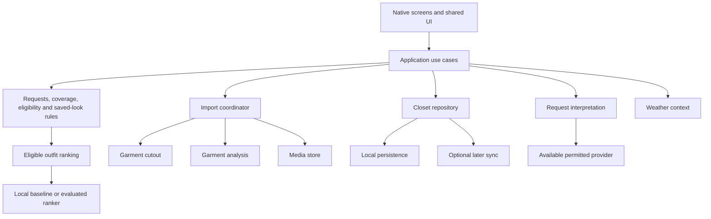

# Technical architecture and engineering specification

Read with [the handoff](../../BUILD-PLAN.md). These contracts describe the intended system. Add each boundary when its first real implementation is built; do not scaffold an unused service framework.

## 1. Continue the current foundation

The checked-in application uses Expo 57.0.26, React Native 0.86.3, React 19.2.3, TypeScript 6.0.3, and Expo Router. These are repository observations, not a promise that they remain the latest versions when implementation resumes. Keep the lockfile and use Expo-compatible versions when adding native dependencies.

Use the newest compatible stable tooling that the target hardware can run reliably. Recheck official release notes before an upgrade. Do not combine a major framework migration with an unrelated feature unless a required capability makes it necessary.

The current app targets iOS 26 or later, has iOS scene support enabled, uses portrait orientation, and does not claim tablet support. Confirm the wife's actual phone before selecting a stronger minimum. OS version, hardware capability, model availability, model downloads, and supported languages are separate checks.

Retain React Native for screens and shared domain logic. Add focused Swift integrations through local Expo modules for capabilities that need Apple APIs. Native code/configuration must survive regeneration of the ignored `ios` directory. Expo documents development builds and local modules for this workflow. [Custom native code](https://docs.expo.dev/workflow/customizing/).

Keep the browser preview useful for layout and domain flows. Camera behavior, native models, safe areas, permissions, thermal limits, and data protection need physical-device validation.

## 2. Module boundaries



The domain must not import React, navigation, native SDK types, or vendor response schemas. Screens call use cases and display typed states. Adapters translate provider outputs into the app's own types and validate them.

Extend the current folders:

- `src/domain`: garments, preferences, requests, eligibility, coverage, candidate generation, ranking baseline, and invariants.
- `src/features`: Today, request editing, import review, photo help, hijab replacement, and preference editing.
- `src/state`: repository subscriptions and application state orchestration.
- `src/storage`: repository/media implementations and migrations.
- `src/capabilities`: implemented processor/parser/weather/ranker adapters when needed.
- `src/ui`: semantic theme, reusable controls, and the shared flat lay.
- `modules`: focused local native integrations if required.
- `app`: routes and navigation composition.
- `fixtures`: explicit synthetic or consented test data, with personal photos excluded from public source control.

Use dependency injection at a small application composition point. One interface and one implementation are enough initially. Do not add microservices, an event bus, a plugin marketplace, or a monorepo for this personal app.

## 3. Domain model

### Garment and evidence

Keep each real closet item stable across edits. Separate category, subtype, outfit role, and style context.

| Field group | Examples | Source |
| --- | --- | --- |
| Identity | ID, created/updated time, display name | App and user |
| Organization | Category, subtype, style tags, optional set ID | Proposed recognition, corrected by owner |
| Media | Original, cutout, thumbnail, visible bounds, processing version | Media pipeline |
| Appearance | Dominant/accent colors, pattern, visible embellishment | Image proposal with uncertainty |
| Coverage | Sleeve reach, neckline, hem, openings, lining/opacity needs | Evidence plus owner confirmation where necessary |
| Fit on owner | Preferred looseness, actual reach, excluded contexts | Owner |
| Comfort/weather | Warmth, breathable preference, rain/snow suitability | Known product information or owner-confirmed use |
| Availability | Available, laundry, archived, unavailable | Owner or explicit application action |
| Provenance | Sample, owned, reference-only | App and owner |

Use an evidence wrapper for important inferred attributes: value or unknown, source, confidence when meaningful, reviewed state, and version/time. A high model score is not owner confirmation. A user correction takes priority over future automated proposals unless she asks to reconsider it.

Do not require all fields for import. A garment can be cataloged with unknown coverage or weather suitability. Explain missing evidence when it affects a recommendation. Keep unknown, false, and not applicable distinct.

A style tag may have several values. A linked set has distinct component IDs. A pair of shoes is one item with its own photos. Additional views are media on the same item.

### Core entities

| Entity | Required purpose |
| --- | --- |
| Garment | Current item identity, media, attributes, and availability |
| MediaAsset | Stable managed file references, dimensions, variants, and provenance |
| GarmentSet | Optional relationship among independently usable pieces |
| CoverageProfile | Explicit personal coverage preferences |
| EverydayPreset | Usual occasion/style, coverage reference, comfort/taste preferences, version |
| OutfitRequest | Fully resolved temporary intent and constraints |
| OutfitCandidate | Owned IDs, layers/roles, eligibility evidence, score components, and reasons |
| DailySuggestion | Local day, timezone, preset version, request, selected IDs, and current variant |
| OutfitDraft | Unsaved user edits that survive navigation and app interruption |
| SavedLook | Name, item IDs, optional context, created/updated time, and source variation |
| Feedback | Contextual reaction or explicit favorite; separate confirmed wear event |
| ImportJob | Durable source, state, attempts, processor version, cancellation, and outputs |
| ConsentRecord | Specific sharing purpose, version, scope, and revocation where needed |

Only implement the subset needed by the current packet. In particular, account identifiers, sync outboxes, billing entitlements, and provider-job tables are later additions.

## 4. Outfit request contract

An illustrative TypeScript shape follows. Refine exact names to match the existing code; preserve these meanings.

```ts
type WeatherContext =
  | { source: "unknown" }
  | {
      source: "manual";
      warmth: "warm" | "mild" | "cold";
      precipitation: "dry" | "rain" | "snow";
      exposure: "mostly-indoors" | "time-outside";
    }
  | {
      source: "forecast";
      placeId: string;
      validFrom: string;
      validTo: string;
      retrievedAt: string;
      feelsLikeC: number | null;
      precipitation: "dry" | "rain" | "snow" | "unknown";
      windMetersPerSecond: number | null;
      exposure: "mostly-indoors" | "time-outside";
    };

type OutfitRequest = {
  id: string;
  revision: number;
  mode: "everyday" | "occasion";
  localDate: string;
  timeZone: string;
  presetId: string | null;
  presetVersion: number | null;
  occasion: {
    kind: string;
    detail: string | null;
    event: {
      startsAt: string;
      endsAt: string | null;
      timeZone: string;
      placeId: string | null;
    } | null;
  };
  style: "desi" | "western";
  mood: string | null;
  requiredItemIds: string[];
  requiredGarmentTypes: string[];
  excludedItemIds: string[];
  coverageProfileId: string | null;
  weather: WeatherContext;
  sourceLookId: string | null;
  wardrobeMode: "sample" | "owned";
};
```

The initial control flow can use a smaller subset. Future Either / Mix style support should be an explicit schema extension, not an undocumented empty value. Typed enums for implemented occasion/type choices should replace unconstrained strings where useful.

Resolve defaults once into the request. Both structured controls and language interpretation create the same contract. Persist the resolved request with the chosen result so an outfit remains explainable after a default changes. The local daily key identifies the dressing session; an optional event has its own time and place. Use that event window for forecasts when present, with an explicit timezone rather than ambiguous date parsing.

Validate IDs, duplicates, missing items, availability, sample/owned mode, recognized types, weather units, date ranges, and preference references. A type requirement can be fulfilled by a kept item; do not add a second blazer just because both fields mention it.

## 5. Recommendation algorithm

### Hard eligibility before ranking

1. Resolve the active preset plus explicit overrides.
2. Validate the request and resolve every kept ID against the current closet.
3. Filter unavailable, excluded, wrong-provenance, and known incompatible items.
4. Retrieve saved looks with all exact kept IDs and compatible known context.
5. Construct candidate combinations using garment roles and reviewed templates.
6. Check required IDs, required garment types, relevant style, complete layering, coverage, and known weather requirements.
7. Separate eligible, needs-review, and conflicting candidates. Do not mix these states in a confident ready-to-wear list.
8. Rank eligible candidates for taste and variety.
9. Revalidate the final IDs and request revision immediately before display/save.
10. Present a small number of distinct actual combinations, with reasons grounded in their evidence.

The ranker cannot restore a candidate removed by hard validation. Model output must never invent an item ID, alter a required item, or declare unknown opacity suitable.

### Role templates

Use templates as starting structures, not rigid categories:

- Top/tunic, lower garment, hijab when required, footwear; optional compatible layer/bag/accessories.
- Closed long dress, hijab when required, footwear; underlayers or trousers when required by the garment/profile.
- Open abaya with independently valid clothing beneath it.
- Desi kurta/kameez with a compatible lower garment and required scarf roles.
- A linked set whose pieces remain independently addressable.

Validate openings, length, layering, and personal fit evidence across the combination. A dress and trousers may be valid together. Removing an outdoor coat must not expose an unaddressed coverage requirement indoors. Accessories and bags should not be added solely to reach a fixed item count.

Bound enumeration by role, availability, and plausible pairings. Keep required items through pruning. For larger closets, retrieve a bounded candidate pool per role, then diversify and rank. Detect when search limits, rather than actual wardrobe insufficiency, caused no result; do not falsely claim no possible outfit exists.

### Baseline ranking

Begin with transparent, deterministic signals: compatible colors/patterns, silhouette balance, occasion preferences, known comfort/weather, explicit favorites, pairing feedback, and suggestion diversity. Use a deterministic tie-breaker for a given daily request and an explicit alternative cursor or seed for Try another.

Keep score components internal and explain only useful facts. Tune relative weights from her choices. A mathematically high score is not a universal fashion judgment.

Wardrobe discovery uses exposure or confirmed wear separately. Exclude recently dismissed pairings in the relevant context. Do not penalize a reliable favorite simply to maximize item turnover.

### Saved looks and replacements

An exact saved match must satisfy the current request as stored. Adapting it creates a variation with a source reference. A missing item requires repair and must not be silently substituted.

For a single-item replacement, treat every other current ID as fixed. Revalidate the complete result. If a broader change is required, return a typed explanation and a separately chosen restyle action.

### Failure result

Return structured problems, such as missing required item, unavailable item, no garment of the requested type, unknown opacity, missing suitable footwear, incompatible kept pieces, or unavailable capability. Include the affected IDs and allowed next actions. Preserve the user's draft and constraints.

## 6. State and persistence rules

- Store everyday defaults separately from today's request and occasion drafts.
- Key daily suggestions by local calendar date and timezone, not simply UTC midnight.
- Record the preset version used. Editing the preset changes future defaults; explicitly offer whether to restyle today.
- Keep a stable result through app reopening and tab changes.
- Check local-day rollover on foregrounding. Preserve unsaved drafts across midnight and daylight-saving transitions.
- Guard asynchronous results with request IDs/revisions and cancellation. Latest intent wins.
- Serialize writes or transact related changes. A failed write must not make the UI claim success.
- Disable duplicate submissions while committing; retries must be idempotent.
- A deleted garment may invalidate suggestions but must not erase a saved outfit's history or resurrect through a late job.
- Saving a variant is distinct from updating its source.
- The manual builder and saved looks must remain usable offline.

Current `ClosetRepository` already queues writes and updates its snapshot after storage succeeds. Preserve that invariant as the model grows.

## 7. Migration strategy

The current `closet.v1` JSON contains `version`, `pieces`, `looks`, and an optional sample-seeding marker. Its decoder rejects malformed content. Maintain recovery behavior during expansion.

For the first styling packet, a small versioned snapshot extension is acceptable if migration is explicit and tested. Introduce normalized SQLite tables when durable import jobs, richer queries, or sync justify them. SQLite remains appropriate local persistence; Expo's library persists databases across app restarts. [Expo SQLite](https://docs.expo.dev/versions/latest/sdk/sqlite/).

Migration sequence:

1. Read the original snapshot without overwriting it.
2. Decode and validate the known old schema.
3. Keep a recoverable backup of the metadata for the migration window.
4. Transform to the new schema, preserving item IDs, look IDs, references, sample markers, names, and photo locations.
5. Validate all transformed data. Unknown new attributes default to unknown, not invented values.
6. Commit atomically or to a new versioned key/database, then switch after verification.
7. On failure, retain the old records and present recovery. Never reset to an empty closet automatically.

Test migrations with real fixture copies containing edited samples, removed samples, saved looks with missing items, empty wardrobes, and unfamiliar optional fields. Version the sample catalog independently so a new dress can be added once without re-adding intentionally deleted pieces. Consider a sample-removal ledger or explicit per-fixture migration rather than reseeding all items.

Before enabling commercial sync, use stable tables and explicit tombstones. A cloud database does not automatically provide correct offline synchronization.

## 8. Media and import contracts

| Capability | Input | Output and invariant |
| --- | --- | --- |
| MediaStore | Selected image or managed asset reference | Durable local asset; metadata and lifecycle controlled by app |
| GarmentCutout | Oriented working image and cancellation | Mask/cutout, bounds, quality issues; no garment invention |
| GarmentAnalysis | Image references and supported vocabulary | Attribute proposals with evidence/unknowns |
| ImportCoordinator | Batch source IDs and sharing policy | Resumable per-item stages and idempotent accepted items |
| ReferenceInterpretation | Selected reference and user's focus | Editable visual brief; no ownership claims |
| RequestInterpretation | User text plus allowed vocabulary/context | Validated request changes or clarification |
| OutfitRanking | Eligible candidates and preference context | Ordered candidate IDs and grounded score components |
| WeatherProvider | Chosen place/time and permission context | Normalized dated conditions with freshness |
| ClosetRepository | Domain records and mutations | Validated persistence with migration and conflict handling |

Each implemented capability should expose availability, cancellation, timeout, and typed failure states. An unavailable provider can return a local/manual fallback only if that fallback is honest and permitted.

Keep file copying, native processing, and cloud transport out of screen components. Large image work must not run on the JS UI thread. Native modules should return managed references or bounded metadata, not repeatedly send full-resolution pixel buffers across the bridge.

## 9. Model and service decisions

Select per capability and evidence. Do not require one model to perform every task.

| Candidate | Proposed experiment | Required proof |
| --- | --- | --- |
| Apple Vision | Native faithful foreground cutouts | Difficult garment edge quality, correction effort, and device cost |
| Available local vision model | Garment naming and supported attributes | Correct garment vocabulary, uncertainty, latency, and memory |
| Apple Foundation Models where supported | Structured interpretation and grounded language | Runtime availability, supported input modalities/languages, privacy behavior, and domain accuracy |
| Cactus Needle | Short text to typed styling intent | Correct constraints, negation, multiple selected items, and unsupported-request handling |
| Jev | Rank eligible combinations on narrow preference factors | Better preference judgments than the baseline, acceptable cost/latency, and suitable data terms |
| Optional embedding model | Reference-to-owned-item retrieval | Better relevance than ordinary attribute filters |
| Optional forecast provider | Dated local weather context | Coverage, attribution, freshness, cost, and privacy fit |

Needle's vendor describes text-based tool calls and extraction, with iOS artifacts and `needle3.cact` deployment. Treat the user's remembered `.bin` filename as a reference to investigate, not an API contract. It is a candidate parser, not the garment cutout model. [Cactus Needle](https://cactuscompute.com/needle).

Jev documents typed choices and scores. Use it, if evaluation supports it, after eligibility checks. Its confidence does not establish religious, garment-fit, or weather correctness. [TypeSafe introduction](https://docs.typesafe.ai/introduction).

Apple capability availability must be checked on the selected deployment target and actual device. Earlier research proposed multimodal Foundation Models; verify exact SDK APIs and modality availability in the native spike before making image-analysis promises. Do not infer support from an OS minimum alone. [Foundation Models documentation](https://developer.apple.com/documentation/foundationmodels).

WeatherKit is one provider to evaluate later, with its terms and attribution obligations checked before integration. Manual weather remains independently usable. [WeatherKit](https://developer.apple.com/weatherkit/).

For every candidate: record model/version, supported devices, license and redistribution terms, telemetry behavior, retention/training terms, download size, peak runtime memory, cold/warm latency, energy use, and failure behavior. Local inference must be verified for actual network traffic, including library telemetry.

Do not enable vendor examples that automatically execute arbitrary parsed actions. Parse into an allowlisted domain command and validate it. Upload, deletion, consent, or payment actions require their own product authorization flow.

## 10. Privacy, security, and future backend

Use local processing and storage by default where feasible. Keep optional cloud processing purpose-specific and explicit. A consent to backup is not consent to remote image analysis. Revocation must affect queued and future work.

Private wardrobe images, coverage preferences, embeddings, and reference images need private storage and per-user access checks if a backend is introduced. Store credentials server-side. Avoid placing long-lived provider tokens or private photo URLs in the app bundle, logs, or error reports.

A future managed Postgres/auth/object-storage service can be selected when backup and account work begins. Keep its SDK behind adapters. Enforce ownership on every server query and storage object, and test isolation with two accounts.

Plan a durable outbox, idempotent upload operations, tombstones, versioned writes, and conflict resolution before sync. Never overwrite offline outfit edits silently. Use short-lived authenticated access to private assets and verify deletion across derived files and jobs.

Input limits, file validation, safe image decoding, parameterized queries, URL allowlists where applicable, and rate limits belong in the relevant boundary. Reference-image text and imported metadata are untrusted content. They cannot modify system prompts, grant permissions, or invoke tools outside the allowed request schema.

## 11. Developer experience

- Use the existing npm lockfile and scripts. Keep one package manager.
- Keep strict TypeScript and runtime validation at storage, native, and service boundaries.
- Keep small domain functions independently testable without mounting screens.
- Reuse shared theme/components. Do not scatter colors, duplicate styling rules, or import providers in UI files.
- Avoid extra state libraries until an actual problem requires one. Keep transient UI state local and persisted domain state in the repository.
- Use platform file extensions and local modules for native differences.
- Keep image/model fixtures and evaluation cases versioned, with no private photos or secrets in the public repository.
- Use deterministic seeds/time injection for daily-suggestion tests.
- Add structured error codes for recoverable failures. User-facing messages should explain a next action.
- Commit logical working checkpoints and summarize changes, verification, and actual limitations.
- Follow the user's no-code-comments rule with self-documenting names and focused modules.

Baseline commands:

```sh
npm ci
npm run check
npx expo-doctor
npm run ios
npm run web
```

Do not run `npm ci` over an active task unnecessarily. Rebuild the development app after native dependency or configuration changes. Use Expo-compatible dependency installation and inspect the resulting lockfile.

Known environment notes: default LAN binding worked for the development server; forcing localhost encountered an IPv6-related issue in this environment. A dedicated Closet Development simulator exists. Preserve unrelated simulators and apps. Maestro worked for native interaction; the available idb supported inspection but had tap compatibility trouble with the installed Xcode. Treat these as local observations, not cross-machine guarantees.

The existing builder uses keyboard-event padding to keep the name/footer above the iOS sheet keyboard. Recheck native keyboard behavior whenever changing that layout. Restart after changing simulator text size if native intrinsic label widths appear stale.

## 12. Performance targets and measurement

Set budgets on the wife's phone and the oldest proposed supported phone. Initial targets to validate, not claims of current performance:

- Item selection updates the visible local preview within about 100 ms for a normal outfit.
- Local candidate generation completes within about one second for a realistic 100-300 item closet, with a bounded search and cancellation.
- Scrolling uses thumbnails and remains responsive during background import.
- A photo import's active user effort is low enough for several pieces in one short session; record processing time separately from user effort.
- App reopening restores the last usable outfit and closet promptly without reloading every original image.
- A long batch avoids runaway memory, excessive heating, or repeated work after interruption.

Measure median and slow-tail latency, cold/warm runs, peak memory, storage growth, and failures. Tune before adding more models. A synthetic sample closet does not establish real-photo performance.
